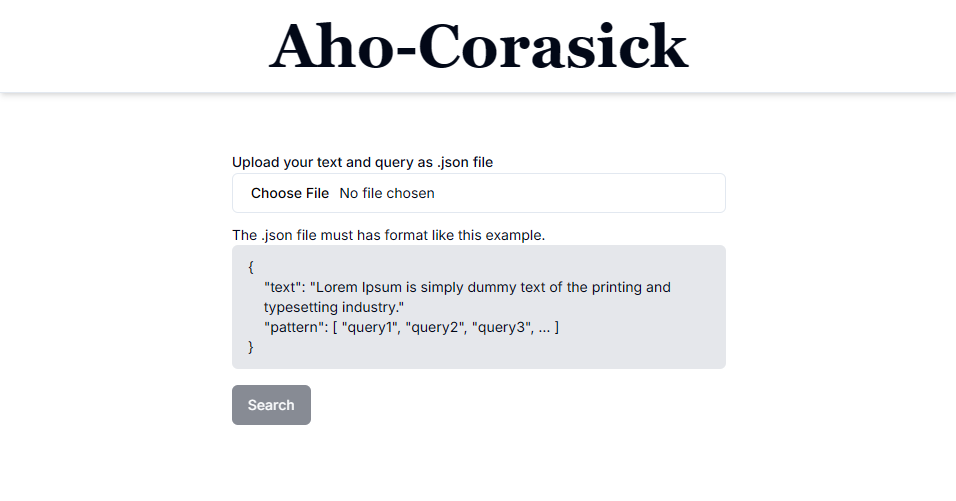
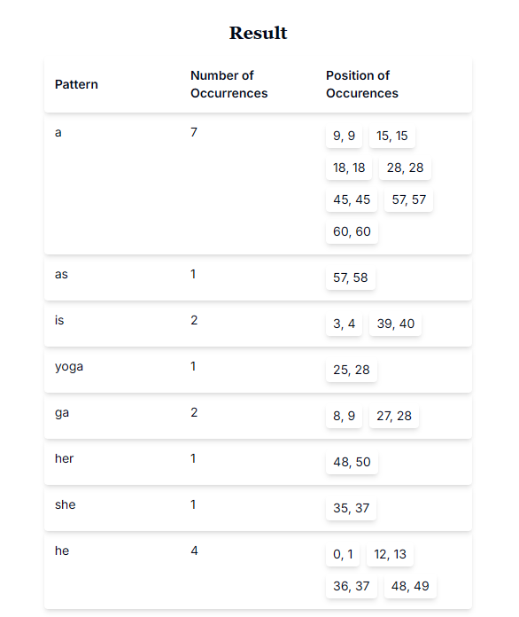
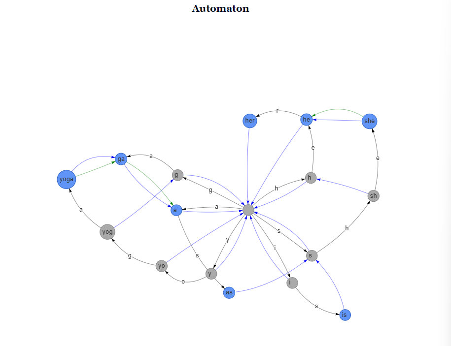

# Aho-Corasick

> Author: Suthasoma Mahardhika Munthe 

The Aho-Corasick algorithm is a string-searching algorithm used to efficiently find multiple patterns (or keywords) in a given text simultaneously. It is particularly effective when you need to search for several strings in a single pass through the text. Here's how it works:

#### **1. Constructing the Trie**

- **Build a Trie:** First, all the patterns are inserted into a Trie (prefix tree). Each node in the Trie represents a character of the patterns. The edges between nodes represent transitions based on characters.

#### **2. Building the Failure Links**

- **Failure Function:** After building the Trie, the algorithm constructs failure links (or "failure functions") for each node. These links help in determining the next state (node) if a character mismatch occurs during the search. Essentially, they allow the algorithm to efficiently backtrack to the longest possible suffix that matches the pattern.

#### **3. Searching**

- **Search Phase:** Using the constructed Trie and failure links, the algorithm processes the text. For each character in the text, it follows the transitions in the Trie and uses the failure links to handle mismatches. This way, it finds all occurrences of the patterns in linear time relative to the size of the text.

#### **Key Features:**

- **Efficiency:** The Aho-Corasick algorithm efficiently handles multiple patterns in linear time relative to the size of the text and the total length of all patterns combined.
- **Output Links:** During the search, it also identifies where in the text each pattern occurs.

#### **Applications:**

- **Text Processing:** Used in applications like text search, spam filtering, and malware detection where multiple patterns need to be searched simultaneously.
- **Networking:** Employed in network intrusion detection systems to search for known attack signatures.

In summary, the Aho-Corasick algorithm is a powerful and efficient way to search for multiple patterns in a text, leveraging Trie data structures and failure links to handle mismatches effectively.


## How to Run

> Make sure you have installed npm and Node.JS to run this program

Clone or download this project. Go to the root directory of this project.

Then, install all the dependencies using this command
```
npm install
```

Run the program using this command
```
npm run dev
```

## Overview

<div align=center>

<br>
  <b>Fig 1.</b> Main page
<br>
</div>

<div align=center>

<br>
  <b>Fig 2.</b> Result  
<br>
</div>

<div align=center>

<br>
  <b>Fig 23.</b> Automaton Visualizer  
<br>
</div>

## Bonus Worked

- Highlight Index
- Automaton visualizer